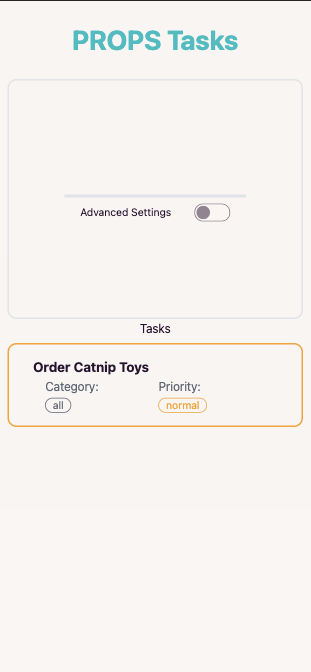
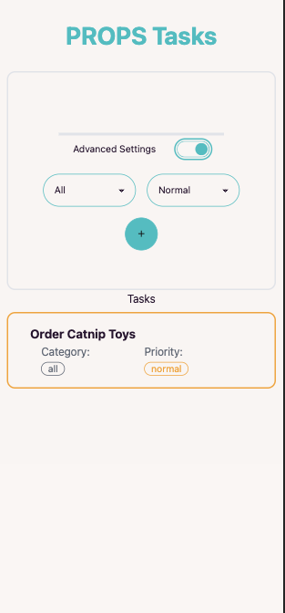
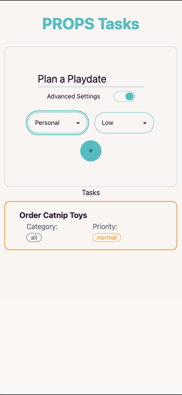
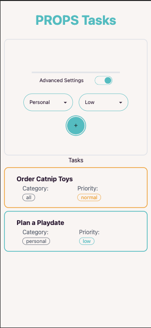
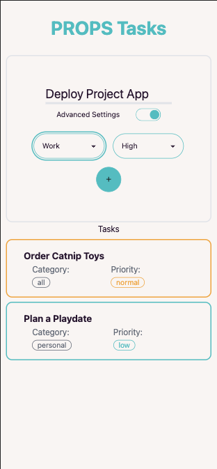
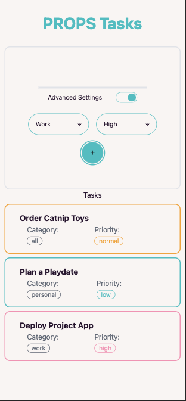
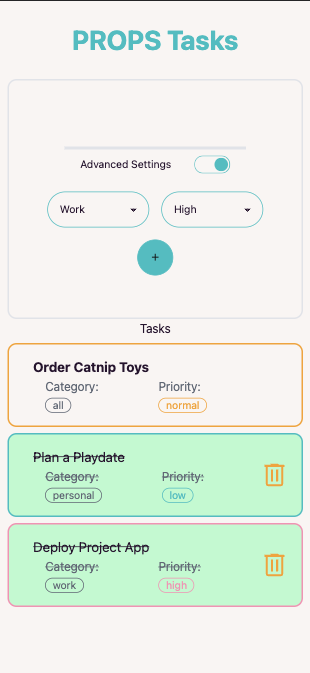

# React + Vite + Tailwind + daisyUI

# [Deployment](https://simpletodo-sfad.onrender.com/)

ADD toggle dark mode

# Mobile

# User Stories

As a user, I would like to be able to create a task to be completed so that I don't forget it. ✅

As a user, I want to be able to mark completed tasks so that I can see how productive I am/was ✅

As a user, I would like to have my tasks displayed clearly so that I don't lose track of them. ✅

As a user, I would like to prioritise my tasks so that I know which task is most important ✅

As a user, I would like to be able to sort my tasks by priority so that the most important tasks are always at the top.🚧

As a user, I would like to be able to create a target date so that I know when a task has to be completed by.🚧

As a user, I would like to be able to sort by open and completed tasks so that my list is always clearly organised.🚧

As a user, I would like to be able to categorise my tasks so that they can be assigned more specifically. ✅

As a user, I would like to be able to sort/filter my tasks by category so that I can see tasks that belong together.🚧

As a user, I would like to be able to delete tasks so that no old or superfluous tasks clutter up my list ✅

# Data Model

task: The task name

done: If the task is done

category: The category of the task

due: The target date

prio: The priority
